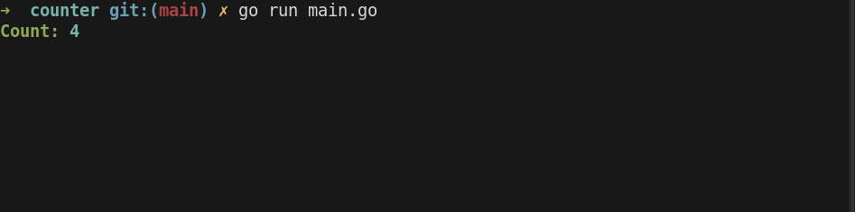
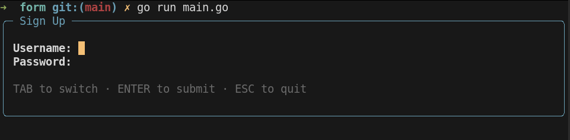
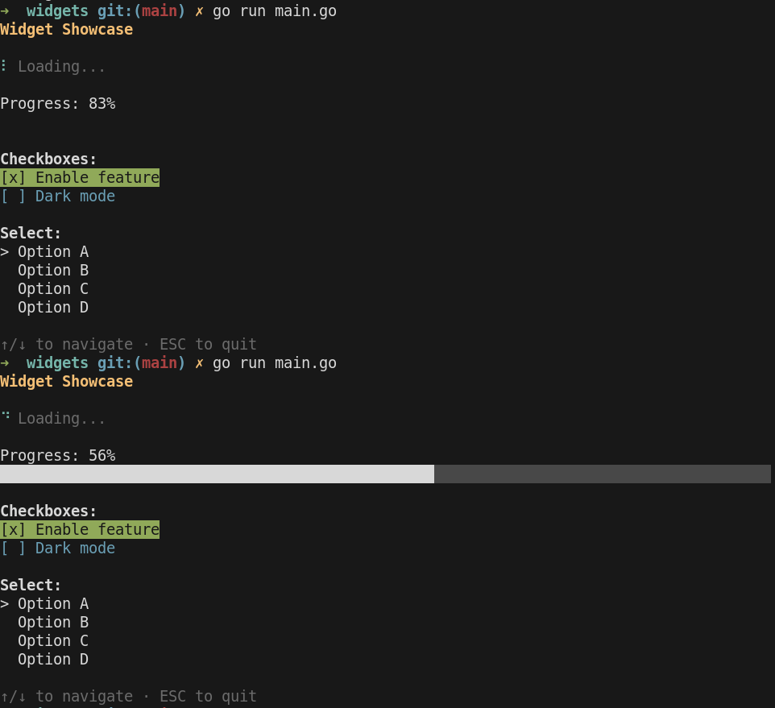
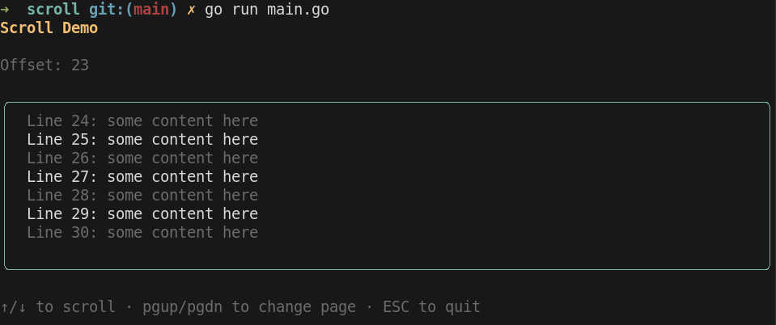
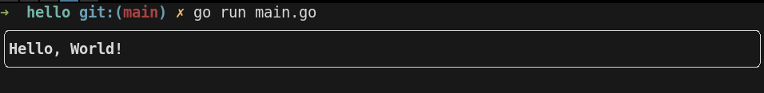
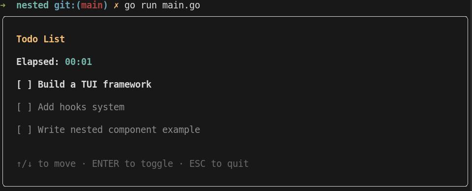
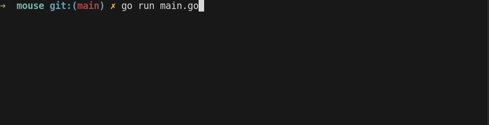

<div align="center">
	<br>
	<br>
	<h1>Quill</h1>
	<br>
	<br>
</div>

> React for terminal UIs in Go. Build interactive CLI apps with hooks, components, and flexbox.

Quill provides a React-like component model for building terminal user interfaces in Go. It uses a built-in CSS Flexbox layout engine, so most layout properties you know from the web work out of the box. If you're familiar with React hooks, you already know Quill.

Renders inline (content-sized) by default. One external dependency: `golang.org/x/term`.

## Install

```sh
go get github.com/rft0/quill
```

## Usage

```go
import (
    "fmt"
    "os"
    "time"

    ll "github.com/rft0/quill"
)

func Counter(ctx *ll.Context) *ll.Node {
    count := ll.UseState(ctx, 0)

    ll.UseInterval(ctx, time.Millisecond*100, func() {
        count.Set(count.Get() + 1)
    })

    return ll.Box(
        ll.Text("Count: ", ll.TextColor(ll.Green), ll.Bold),
        ll.Text(fmt.Sprintf("%d", count.Get()), ll.TextColor(ll.Cyan), ll.Bold),
    )
}

func main() {
    app := ll.New(Counter)
    app.ExitOnCtrlC()
    if err := app.Run(); err != nil {
        fmt.Fprintf(os.Stderr, "error: %v\n", err)
        os.Exit(1)
    }
}
```



## Contents

- [Components](#components)
  - [`Box`](#box)
  - [`Text`](#text)
- [Layout](#layout)
- [Hooks](#hooks)
  - [`UseState`](#usestate)
  - [`UseRef`](#useref)
  - [`UseMemo`](#usememo)
  - [`UseEffect`](#useeffect)
  - [`UseInterval` / `UseAfter`](#useinterval--useafter)
  - [`UseContext`](#usecontext)
  - [`UseForm`](#useform)
  - [`UseTween` / `UseSpring`](#usetween--usespring)
- [Event Handlers](#event-handlers)
- [Widgets](#widgets)
  - [`Input`](#input)
  - [`Textarea`](#textarea)
  - [`Select`](#select)
  - [`Checkbox`](#checkbox)
  - [`ProgressBar`](#progressbar)
  - [`Spinner`](#spinner)
  - [`ScrollView`](#scrollview)
  - [`List`](#list)
  - [`Table`](#table)
  - [`Modal`](#modal)
  - [`Notify`](#notify)
- [Focus Management](#focus-management)
- [Conditional Rendering](#conditional-rendering)
- [Colors](#colors)
- [App Configuration](#app-configuration)
- [Testing](#testing)
- [Examples](#examples)

## Components

Quill apps are built from functional components. A component is a function that takes a `*Context` and returns a `*Node`.

```go
func MyComponent(ctx *ll.Context) *ll.Node {
    return ll.Box(
        ll.Text("Hello!"),
    )
}
```

Compose components using `ctx.Render`:

```go
func App(ctx *ll.Context) *ll.Node {
    return ll.Box(ll.FlexColumn,
        ctx.Render("header", Header),
        ctx.Render("body", Body),
    )
}
```

### `Box`

Flex container. Takes any mix of children (`*Node`) and props.

```go
ll.Box(ll.FlexColumn, ll.Gap(1), ll.BorderRounded, ll.PadXY(1, 1),
    ll.Text("Title", ll.Bold),
    ll.Text("Subtitle", ll.TextColor(ll.Gray)),
)
```

Boxes take all available horizontal space by default (`FlexGrow: 1`). Use `Grow(0)` to opt out.

#### Title

Boxes with borders can display a title on the top edge:

```go
ll.Box(ll.BorderRounded, ll.Title("My Panel"),
    ll.Text("content"),
)
// ╭─ My Panel ────────╮
// │ content            │
// ╰───────────────────╯
```

### `Text`

Styled text leaf node.

```go
ll.Text("Hello!", ll.Bold, ll.Italic, ll.TextColor(ll.Green))
```

## Layout

Quill uses a CSS Flexbox layout engine. All the usual properties are available as props.

**Direction:** `FlexRow` (default), `FlexColumn`

**Wrap:** `FlexWrapWrap`

**Justify (main axis):** `JustifyFlexStart`, `JustifyFlexEnd`, `JustifyCenter`, `JustifySpaceBetween`, `JustifySpaceAround`

**Align (cross axis):** `AlignStretch` (default), `AlignFlexStart`, `AlignFlexEnd`, `AlignCenter`

**Sizing:** `Width()`, `Height()`, `MinWidth()`, `MaxWidth()`, `MinHeight()`, `MaxHeight()`, `Grow()`, `Shrink()`, `Basis()` — accepts `Px()`, `Pct()`, or `AutoDim()`

**Spacing:** `Gap()`, `Padding()`, `PaddingX()`, `PaddingY()`, `PadXY()`, `Margin()`, `MarginTop()`, `MarginRight()`, `MarginBottom()`, `MarginLeft()`

**Borders:** `BorderSingle`, `BorderDouble`, `BorderRounded`, `BorderThick`

**Positioning:** `Absolute`, `Left()`, `Top()`, `Right()`, `Bottom()`, `ZIndex()`

**Text:** `Bold`, `Italic`, `Underline`, `Dim`, `Strikethrough`, `Reverse`

**Overflow:** `Ellipsis`, `ClipText`

**Debug:** `Debug` — draws colored outlines around every node for layout visualization

## Hooks

Hooks must be called in the same order every render, just like React. They are package-level functions because Go doesn't support generic methods on structs.

### `UseState`

Reactive state that triggers re-renders on change. Thread-safe.

```go
count := ll.UseState(ctx, 0)
count.Get()                 // read
count.Set(count.Get() + 1)  // write + re-render
```

### `UseRef`

Stable mutable pointer across renders. Does **not** trigger re-renders.

```go
input := ll.UseRef(ctx, ll.InputState{})
input.Value  // direct field access
```

### `UseMemo`

Cached computation, recomputed only when deps change.

```go
label := ll.UseMemo(ctx, func() string {
    return fmt.Sprintf("Count: %d", count.Get())
}, count.Get())
```

### `UseEffect`

Side effects on mount or when deps change.

```go
// Run once on mount
ll.UseEffect(ctx, func() {
    go fetchData()
})

// Re-run when deps change
ll.UseEffect(ctx, func() {
    go fetchData(id.Get())
}, id.Get())

// With cleanup (runs before re-execution and on exit)
ll.UseEffectWithCleanup(ctx, func() func() {
    conn := connect()
    return func() { conn.Close() }
})
```

### `UseInterval` / `UseAfter`

Timer hooks.

```go
ll.UseInterval(ctx, time.Second, func() {
    count.Set(count.Get() + 1)
})

ll.UseAfter(ctx, 3*time.Second, func() {
    show.Set(false)
})
```

### `UseContext`

Share data down the tree without prop drilling.

```go
var ThemeKey = ll.NewContextKey("light")

// Parent provides
ll.ProvideContext(ctx, ThemeKey, "dark")

// Any descendant reads
theme := ll.UseContext(ctx, ThemeKey)  // "dark"
```

### `UseForm`

Manages focus cycling and form submission across multiple fields.

```go
name := ll.UseRef(ctx, ll.InputState{})
email := ll.UseRef(ctx, ll.InputState{})

ll.UseForm(ctx, ll.FormConfig{
    Fields:   []ll.Focusable{name, email},
    OnSubmit: func() { /* called on Enter at last field */ },
})
```



Tab/Shift+Tab cycles focus. Enter advances to the next field, or calls `OnSubmit` on the last one.

### `UseTween` / `UseSpring`

Animation hooks for smooth transitions.

```go
// Linear tween to target over duration
opacity := ll.UseTween(ctx, 1.0, 300*time.Millisecond)

// Spring physics animation
x := ll.UseSpring(ctx, targetX)
```

## Event Handlers

```go
ll.OnKey(ctx, func(key ll.KeyMsg) {
    switch key.Type {
    case ll.KeyEnter:
        // handle
    case ll.KeyCtrlC:
        ctx.Quit()
    }
})

ll.OnMouse(ctx, func(m ll.MouseMsg) {
    // m.Type, m.X, m.Y
})

ll.OnResize(ctx, func(w, h int) {
    // terminal resized
})
```

Use `ctx.StopPropagation()` to prevent events from reaching other handlers.

## Widgets

### `Input`

Single-line text input with cursor, full editing (backspace, delete, home/end, ctrl+u/k), and focus support.

```go
name := ll.UseRef(ctx, ll.InputState{})
ll.Input(name, ll.TextColor(ll.Yellow))
```

Set `Hidden: true` for password fields:

```go
password := ll.UseRef(ctx, ll.InputState{Hidden: true})
ll.Input(password)  // displays ••••••
```

### `Textarea`

Multi-line text input with line navigation.

```go
editor := ll.UseRef(ctx, ll.TextareaState{})
ll.Textarea(editor, ll.TextColor(ll.White))
```

### `Select`

List picker with j/k/arrow navigation.

```go
sel := ll.UseRef(ctx, ll.SelectState{
    Options: []string{"Option A", "Option B", "Option C"},
})
ll.Select(sel, ll.TextColor(ll.Cyan))
```

### `Checkbox`

Toggle with label.

```go
check := ll.UseRef(ctx, ll.CheckboxState{Checked: true})
ll.Checkbox(check, "Enable feature", ll.TextColor(ll.Green))
```

### `ProgressBar`

Fills available width. Value from 0.0 to 1.0.

```go
ll.ProgressBar(0.75, ll.TextColor(ll.White))
```

### `Spinner`

Self-animating spinner. Built-in frame sets: `SpinnerDots`, `SpinnerLine`, `SpinnerBlock`.

```go
ll.Spinner(ctx, ll.SpinnerDots, ll.TextColor(ll.Cyan))
```



### `ScrollView`

Clipped scrollable container.

```go
scroll := ll.UseRef(ctx, ll.ScrollState{})
ll.ScrollView(scroll, ll.Height(ll.Px(10)),
    // children...
)
```

`ScrollState` provides `ScrollUp`, `ScrollDown`, `PageUp`, `PageDown` methods.



### `List`

Virtualized scrollable list for large datasets. Only renders visible items.

```go
items := []string{"Item 1", "Item 2", /* ...thousands... */}
list := ll.UseRef(ctx, ll.ListState{Focused: true})

ll.OnKey(ctx, func(key ll.KeyMsg) { list.Update(key) })

ll.List(list, 10, len(items), func(i int, selected bool) *ll.Node {
    color := ll.White
    if selected {
        color = ll.Cyan
    }
    return ll.Text(items[i], ll.TextColor(color))
})
```

### `Table`

Column-aligned data table with borders and alignment.

```go
ll.Table(
    []ll.TableColumn{
        {Header: "Name", Width: 20},
        {Header: "Age", Width: 5, Align: ll.TableAlignRight},
    },
    [][]string{
        {"Alice", "30"},
        {"Bob", "25"},
    },
)
```

### `Modal`

Centered overlay positioned above other content.

```go
ll.If(showModal, ll.Modal(
    ll.Box(ll.BorderRounded, ll.PadXY(2, 1), ll.BackgroundColor(ll.Black),
        ll.Text("Are you sure?", ll.Bold),
    ),
))
```

### `Notify`

Toast notification positioned at the top-right.

```go
show := ll.UseState(ctx, true)
ll.UseAfter(ctx, 3*time.Second, func() { show.Set(false) })

ll.If(show.Get(), ll.Notify(
    ll.Text("Saved!", ll.TextColor(ll.Green)),
    ll.BorderRounded, ll.PadXY(1, 0),
))
```

## Focus Management

### `FocusGroup`

Manage Tab/Shift+Tab cycling across focusable widgets.

```go
focus := ll.UseFocusGroup(ctx, name, email, password)

ll.OnKey(ctx, func(key ll.KeyMsg) {
    switch key.Type {
    case ll.KeyTab:
        focus.Next()
    case ll.KeyShiftTab:
        focus.Prev()
    default:
        focus.Update(key)
    }
})
```

### `FocusBorderColor`

Shorthand for focus-aware border colors.

```go
ll.Box(ll.BorderRounded, ll.FocusBorderColor(name.Focused, ll.Cyan, ll.Gray),
    ll.Input(name),
)
```

## Conditional Rendering

`If` and `IfElse` keep the declarative flow clean. Nil nodes are safely ignored by `Box`.

```go
ll.Box(ll.FlexColumn,
    ll.If(showHeader, ll.Text("Header", ll.Bold)),
    ll.IfElse(loggedIn,
        ll.Text("Welcome back!", ll.TextColor(ll.Green)),
        ll.Text("Please log in", ll.TextColor(ll.Gray)),
    ),
)
```

## Colors

**Named:** `Black`, `Red`, `Green`, `Yellow`, `Blue`, `Magenta`, `Cyan`, `White`, `Gray`, `BrightRed` ... `BrightWhite`

**24-bit:** `RGBColor(r, g, b)`

**ANSI 256:** `ANSIColor(n)`

**Interpolation:**

```go
mid := ll.LerpColor(ll.Red, ll.Blue, 0.5)
palette := ll.Gradient(ll.RGBColor(255, 0, 0), ll.RGBColor(0, 0, 255), 20)
```

## App Configuration

```go
app := ll.New(MyComponent,
    ll.WithFullscreen(),  // alternate screen buffer
    ll.WithMouse(),       // enable mouse tracking
)
app.ExitOnCtrlC()  // built-in Ctrl+C handler
app.Run()
```

| Option | Description |
|---|---|
| `WithFullscreen()` | Use alternate screen buffer (full terminal) |
| `WithMouse()` | Enable SGR mouse event tracking |
| `WithCursor(style)` | Set terminal cursor shape |
| `ExitOnCtrlC()` | Add default Ctrl+C quit handler |

## Testing

Quill includes a test harness for headless rendering.

```go
func TestMyComponent(t *testing.T) {
    app := ll.NewTestApp(MyComponent, 80)
    output := app.Output()  // rendered string

    app.SendKey(ll.KeyMsg{Type: ll.KeyEnter})
    output = app.Output()   // after keypress
}
```

`RenderToString` for quick snapshot tests:

```go
root := ll.Box(ll.Text("hello"))
got := ll.RenderToString(root, 40)
```

## Examples

### Hello World

`go run ./examples/hello/`



### Counter

`go run ./examples/counter/`


### Form

`go run ./examples/form/`


### Widgets

`go run ./examples/widgets/`


### Todo



### Mouse

`go run ./examples/mouse/`



### Scroll

`go run ./examples/scroll/`


## License

MIT
